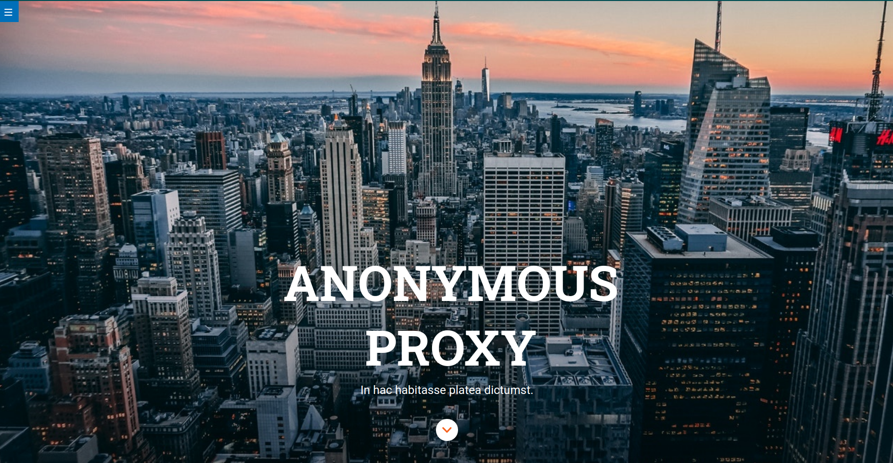

# ANONYMOUS PROXY



## Guía de inicio rápido

> **NOTA:** Necesitas tener instalado [Node JS](https://nodejs.org/) para trabajar con este Starter Kit:

````
Estructura de carpetas
src
 ├─ api // los ficheros de esta carpeta se copian en public/api/
 |  └─ data.json
 ├─ images
 |  └─ logo.jpg
 ├─ js // los ficheros de esta carpeta se concatenan en el fichero main.js y este se guarda en public/main.js
 |  ├─ main.js
 |  └─ events.js
 ├─ scss
 |  ├─ components
 |  ├─ core
 |  ├─ layout
 |  └─ pages
 └─ html
    └─ partials
```

````
